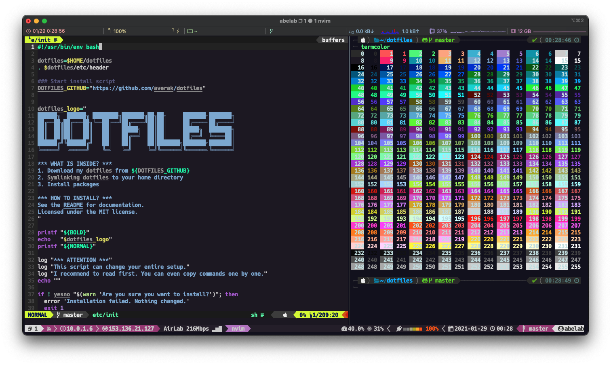

# laserwave.vim

[](https://github.com/averak/laserwave.vim/actions)
[](LICENSE)

An clean 80's synthwave / outrun inspired theme for Vim.



## Usage

1. Install this plugin
2. run `:colorscheme laserwave`

Put the following code in your vimrc.

```vim
" use dein.vim
call dein#add('averak/laserwave.vim')
" use Vim-Plug
Plug 'averak/laserwave.vim'

" If you want to use 256 colors
colorscheme laserwave256
" If not
set termguicolors
```

## References

[Jaredk3nt/laserwave](https://github.com/Jaredk3nt/laserwave)

## Contributing

Bug reports and pull requests are welcome on GitHub at [https://github.com/averak/laserwave.vim](https://github.com/averak/laserwave.vim).
